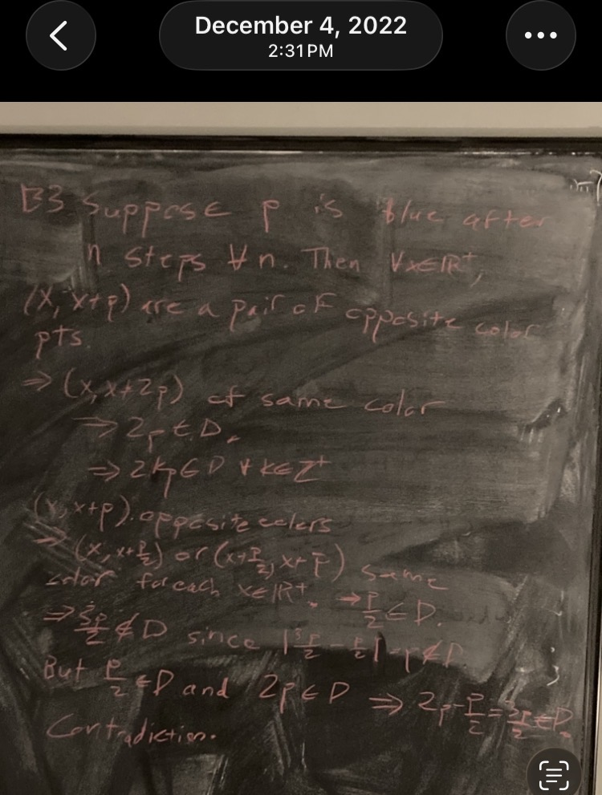

::: {.hidden}
$$
\newcommand{\bA}{\mathbf{A}}
\newcommand{\NN}{\mathbf{N}}
\newcommand{\ZZ}{\mathbf{Z}}
\newcommand{\RR}{\mathbf{R}}
\newcommand{\PP}{\mathbf{P}}
\newcommand{\QQ}{\mathbf{Q}}
\newcommand{\FF}{\mathbf{F}}
\newcommand{\CC}{\mathbf{C}}
\newcommand{\cO}{\mathcal{O}}
\newcommand{\cX}{\mathcal{X}}
\newcommand{\fa}{\mathfrak{a}}
\newcommand{\fm}{\mathfrak{m}}
\newcommand{\fp}{\mathfrak{p}}
\newcommand{\fq}{\mathfrak{q}}
\newcommand{\id}{\mathrm{id}}
\newcommand{\sF}{\mathscr{F}}
\newcommand{\sG}{\mathscr{G}}
\newcommand{\vp}{\varphi}
\newcommand{\sli}{{s_l}_i}
\newcommand{\smi}{{s_m}_i}
\newcommand{\HomC}{\text{Hom}_{\mathscr{C}}}
\newcommand{\mf}{\mathscr{F}}
\newcommand{\Spec}{\text{Spec}}
\newcommand{\Spa}{\text{Spa}}
\newcommand{\Spf}{\text{Spf}}
$$
:::

## Disclaimers

1. Skip "Context" and go directly to "The Problem" to circumvent autobiographical slop and get to the mathematics.

2. Neither the story nor the mathematics is particularly illuminating or interesting. This was just the first easy idea I came up with.

## Context

The 2022 Putnam was my last chance to crack the prestigious top 500 list and forever cement myself as Good at Mathematics. I knew I probably had to get the full ten points on at least two of the twelve problems to do that. I ended up fully solving Problem B2 with about 30 minutes left on the exam, and Problem B3 looked like the easiest one remaining. I didn't end up solving it, I missed the top 500 list, and my life was over forever; I am now homeless. Even worse, I came up with a stupidly short argument the next day:

{fig-align="center" width=70%}

I was hoping to find that I was wrong so I would not feel so bad about failing to solve it, but in fact the solution is one that can be written down in less than a couple minutes once one has the right idea (what I wrote above is a bit sloppily written but essentially correct).

## The Problem

Here is the problem statement and a more complete solution:

::: {.callout-note icon=false}
## Problem B3, 2022 Putnam Mathematical Competition
Assign to each positive real number a color, either red or blue. Let $D$ be the set of all distances $d>0$ such that there are two points of the same color at distance $d$ apart. Recolor the positive reals so that the numbers in $D$ are red and the numbers not in $D$ are blue. If we iterate this recoloring process, will we always end up with all the numbers red after a finite number of steps?
:::

*Solution.* Yes. Assign each positive real number a color, either red or blue. If all positive reals are red after the first recoloring then we are done, so suppose that there exists some $\delta\in \RR^+$ that is blue after the first recoloring. By the definition of $D,$ this means that there are no two points of the same color at distance $\delta$ apart after the first recoloring. From this we deduce

::: {style="text-align: center;"}
**Observation 1.** After the first recoloring, $x$ and $x+\delta$ are of opposite color for all $x\in \RR^+.$
:::

Since $\delta$ is blue, Observation 1 implies that $2\delta$ is red. Since $2\delta$ is red, Observation 1 implies that $3\delta$ is blue. Since $\delta$ and $3\delta$ are both blue and $3\delta-\delta=2\delta,$ it follows that $2\delta$ will be red after the second recoloring.

Now we show that $\delta/2\in D$. Suppose for the sake of contradiction that $\delta/2\notin D,$ that is, any two points of distance $\delta/2$ from each other are of opposite color in the initial coloring. Then since (i) $\delta$ is blue, (ii) $\delta-\delta/2=\delta/2,$ and (iii) $3\delta/2-\delta=\delta/2,$ it follows that $\delta/2$ and $3\delta/2$ are red. But $3\delta/2$ and $\delta/2$ are distance $\delta$ apart, which implies that $\delta\in D$ after the first recoloring, contradicting our assumption that $\delta$ is blue after the first recoloring.

We have found that for any $\delta\in \RR^+$ that is colored blue, we have $2\delta\in D$ and $\delta/2\in D$ after the second recoloring. Thus, after the third recoloring step, $2\delta$ and $\delta/2$ will both be red, hence form a pair of points of the same color at distance $3\delta/2$ apart, and therefore $3\delta/2\in D$. Thus, after the fourth recoloring step, $\delta$ and $3\delta/2$ will both be red; these are a pair of points of the same color at distance $\delta$ apart, so after the fifth recoloring step, we find that $\delta\in D.$ Thus, after five steps, all positive reals will be colored red.

$\square$
\

**Remark 1.** My original argument on the board implies that all numbers should be red after two steps; I checked the solution on the Putnam Archive (available at https://kskedlaya.org/putnam-archive/) and this seems to be correct. Exercise for the reader: Modify the above argument to show all positive reals will be red after two steps.

**Remark 2.** On the exam, I think I was able to come up with Observation 1, but not much else; that was good enough to get 1 point, at least.